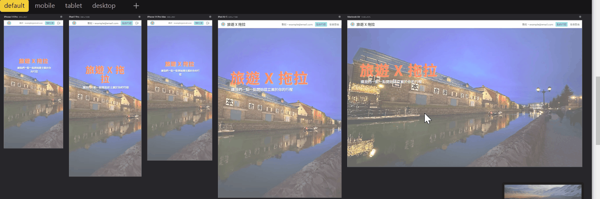
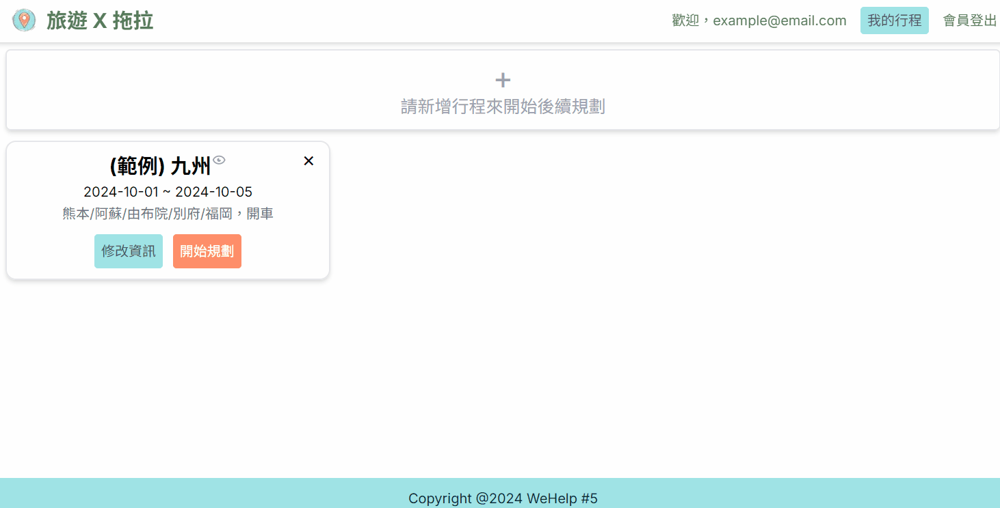
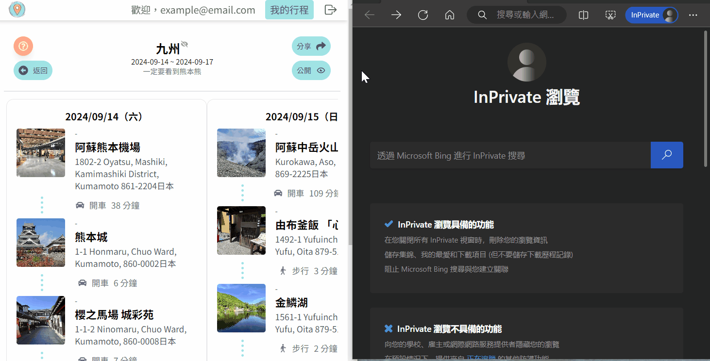

# 旅遊 X 拖拉 Drag to Travel

### 網站簡介
「旅遊 X 拖拉」是一款幫助使用者進行旅遊規劃的工具，包含行程管理、景點搜尋與儲存、行程拖曳安排以及行程分享等功能，適合那些喜歡「先將景點丟進清單、再來做詳細行程規劃」的使用者。

「旅遊 X 拖拉」可讀為「旅遊不拖拉」或「旅遊乘拖拉」，基於開發者本身也是喜歡先把有興趣的景點都先存起來、等對旅程有較多想法再開始規劃，故期望透過本工具幫助有類似習慣的使用者來不拖延地一步一步進行（不拖拉），並在過程中使用較便利的拖曳方式來進行旅遊規劃（乘拖拉）。

### 使用技術

- 使用語言
    - React
        - React Hooks
        - React Context
    - TypeScript
    - Tailwind CSS
    - Next.js
- 資料儲存
    - Firebase
        - Cloud Firestore
- 註冊登入
    - Firebase
        - Authentication
- 網站部署
    - Vercel 
- 地圖套件
    - Google Maps API 
    - @react-google-maps/api
- 拖曳套件 
    - @hello-pangea/dnd

### RWD：針對電腦、平板、手機進行響應式設計

### 網站 Demo

#### (1) 首頁：未登入即可瀏覽
首頁可以看到公開分享之行程與網站使用教學，即使是未登入的使用者也能快速知道網站使用方式，並看到其他網友規劃的行程。

#### (2) 註冊及登入
使用者可以任一信箱註冊及登入。另可使用測試帳號一鍵快速登入。

#### (3) 行程管理：建立、編輯或刪除行程
為了開始後續規劃，使用者必須先建立至少一個新行程，輸入行程名稱、開始與結束日期、備註後儲存，點擊「開始規劃」後進入下一頁。

#### (4) 搜尋景點：建立暫存清單、搜尋&儲存景點
基於「還不確定要去哪裡，但先把有興趣的景點都先存起來」的精神，本頁提供使用者建立一個個清單，並透過頁面上導入的 Google Maps API 服務搜尋景點、將景點存放進清單。

#### (5) 規劃行程：隨意拖動景點來排行程
當清單有足夠景點，本頁可以拖曳清單中已存景點至任意日期區塊，並可加入抵達/離開時間，或切換交通方式，規劃到一個段落記得儲存。

#### (6) 分享行程：分享連結、公開行程
本頁為行程綜覽，使用者可以較寬裕乾淨的畫面檢視行程，點擊「分享」可將頁面連結分享給朋友，點擊「公開」可將頁面公開在首頁、讓所有人（含未註冊的人）都能看到。

